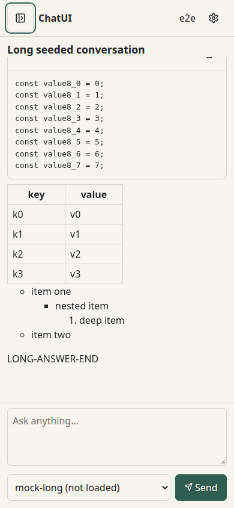
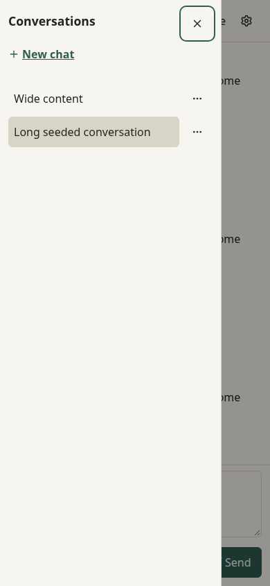
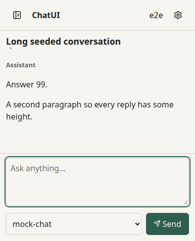
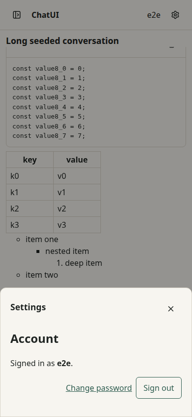
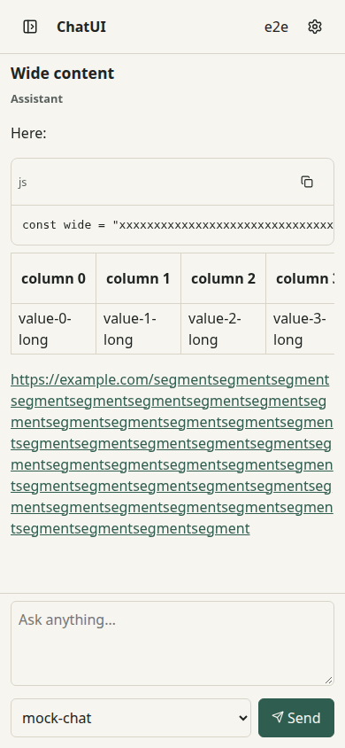
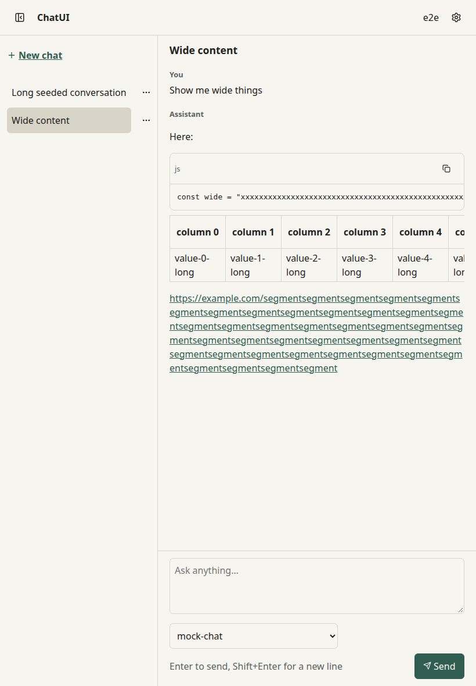
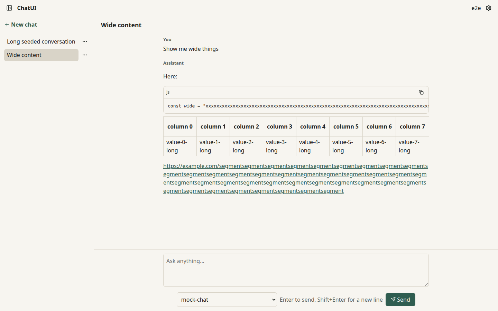

## Phase 11 report

- **Scope completed (files/features):**
  - Breakpoint 768 px (`app/lib/use-media-query.ts`, `app/app.css`). CSS switches the layout (SSR-correct at every width); `useNarrow()` switches behaviour only.
  - Sidebar drawer (`app/components/SidebarDrawer.tsx`, lazy):
    - Radix Dialog, modal: focus trap, Escape and backdrop dismissal
    - explicit focus return to the menu button
    - `inert` background (`.app-main`); closes on navigation
    - no swipe-to-dismiss
  - Viewport and keyboard:
    - viewport meta `viewport-fit=cover, interactive-widget=resizes-content`
    - shell height `var(--app-height, 100dvh)`
    - `useVisualViewportHeight`: the iOS-only fallback for overlaying keyboards, with the justification documented in the hook
    - `env(safe-area-inset-*)` padding
    - 16 px inputs on touch (no iOS focus zoom)
  - Composer: stays visible when the keyboard shrinks the viewport. Below the breakpoint it's compact (shorter textarea, selector + Send on one row, no keyboard hint).
  - Overlays: bottom sheets below the breakpoint (full width, `90dvh`, safe-area); menus stay collision-aware.
  - Touch: at least 44×44 px targets below the breakpoint and on coarse pointers; no hover-only functionality; prefetch also warms on pointerdown/focus.
  - Scrolling: `overscroll-behavior` contained on nested scrollers; scroll intent unchanged across viewport resizes.
  - Wide content:
    - Fixed column widening by long code lines (`minmax(0, 1fr)` tracks, `min-width: 0`).
    - Fixed table cells wrapping letter by letter (they inherited `overflow-wrap: anywhere`).
    - Fixed the composer overflowing at 390 px (a fit-content actions row and a min-content grid track).
    - All three were found through the screenshots, and the E2E no-overflow check now covers shell elements.
  - Test infrastructure: the server-test helper leaked every temporary `DATA_DIR`. About 6,600 directories (2.8 GB) exhausted the `/tmp` quota and stopped the shell mid-phase. Cleanup now runs after every test file (`afterAll`, with the exit hook as a fallback). The slow-observer streaming test was hardened (a 38 MB flood so kernel socket buffers can't absorb the unread stream, and explicit timeouts) after two flakes under load.
- **Checks (Playwright device emulation, `tests/e2e/mobile.spec.ts`):**
  - Phone 390×844 (touch, mobile):
    - drawer focus trap, Escape, restored focus, inert background, backdrop tap, closes on navigation
    - composer visible and focused with a simulated keyboard (viewport height reduced to 480 px); the transcript stays pinned and the page doesn't scroll
    - streaming while scrolled up keeps the position through a resize
    - Settings is a bottom sheet flush with the viewport edges; a menu opened at the right edge stays on screen
    - every control in the shell, drawer and sheet is at least 44×44
    - wide code and a wide table scroll inside themselves, with no page or shell overflow
    - orientation change to 844×390 gives the two-column layout without overflow, and back
  - Breakpoint: 767 px drawer; 768 px and 769 px in-grid sidebar, with no overflow.
  - Tablet 820×1180: two columns, collapse/expand, no overflow.
  - Desktop 1440×900: centered dialogs (not sheets), no overflow.
  - Component: `tests/client/scroll-pin.test.tsx` shows a keyboard-close scroll clamp doesn't unpin. The existing primitive tests (focus, Escape, portal) still pass.
- **Screenshots** (from the Playwright runs):

  | Size                         | File                                                 |
  | ---------------------------- | ---------------------------------------------------- |
  | Phone, chat                  |                |
  | Phone, drawer                |            |
  | Phone, keyboard (390×480)    |        |
  | Phone, Settings bottom sheet |  |
  | Phone, wide code and table   |              |
  | Tablet 820×1180              |                        |
  | Desktop 1440×900             |                      |

- **Quality gates:**
  - `format:check`, `lint`, `typecheck`: PASS
  - `test`: PASS (32 files, 452 tests)
  - `verify`: PASS (76/76)
  - `test:e2e`: PASS (40/40)
  - `verify:compose` (Docker, rootless Podman) in CI
  - `npm audit`: 0 vulnerabilities
- **Budget change (explained, per contracts §9.5):** `critical-css` rose from 2,197 B to 2,679 B gzip (+482 B). The responsive rules (narrow layout, drawer, bottom sheets, safe areas, touch targets) must be in the critical stylesheet to render the first paint correctly on phones; they can't load on demand. JS budgets are unchanged: `critical-chat-js` is 185,940 B, within the 10% tolerance of its 183,637 B budget. The drawer (Radix Dialog) stays out of the critical bundle.
- **Invariants:** INV-47, touch and screen-reader portion for the Phase 7 primitives and the new drawer (focus, Escape, portal, collision) → mobile E2E and primitive tests. INV-32 (scroll intent unchanged on resize) → scroll-pin unit test and mobile E2E.
- **Behaviour changes from earlier phases:**
  - Below 768 px the menu button opens a drawer instead of collapsing the column.
  - Dialogs are bottom sheets on phones.
  - The composer is compact on phones.
- **Dependencies:** none new.
- **Deviations / limitations / unverified items:**
  - Emulation only (Chromium device emulation): no physical phone was available here.
  - A virtual keyboard is simulated by reducing the viewport height (what `interactive-widget=resizes-content` produces). iOS Safari's overlaying keyboard (`--app-height` path) and real safe-area insets are unverified in automation.
  - Phase 12 must add file-picker/attachment keyboard regressions; Phase 14 extends the wide-content check to math.
- **Commit/tag status:** commit `feat(phase-11): responsive layout and mobile interaction model` and tag `phase-11`, pushed to `origin/main`.
- **Questions needing approval:** none.
