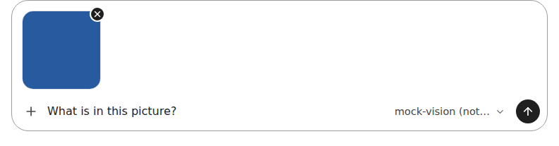
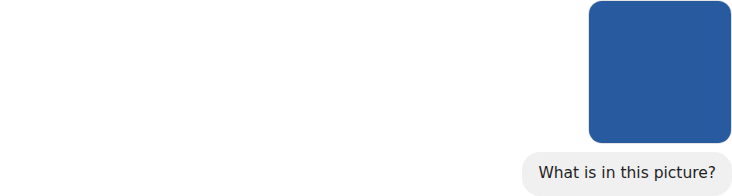
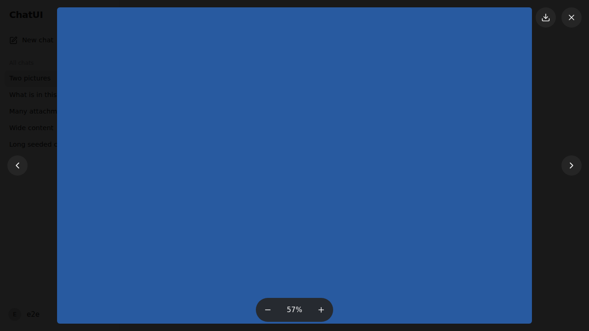
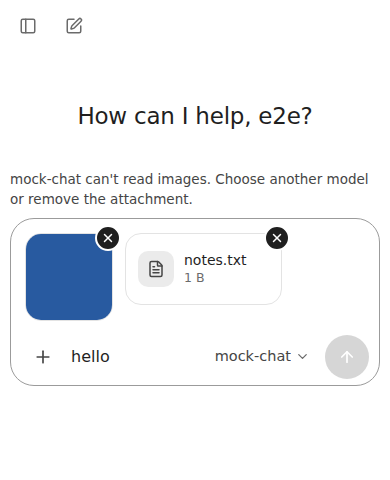

## Phase 12 report

- **Scope completed (files/features):**
  - Storage (`server/storage/attachments.ts`, `server/storage/paths.ts`):
    - `data/<user>/attachments/<uuid>/blob` + `meta.json` (written last), server-minted ids.
    - Streaming upload with the size enforced mid-stream, SHA-256, atomic rename.
    - Per-attachment locks in the contracts §2 order.
    - Quota reservations before streaming; bounded concurrent uploads.
    - Link, pending delete, conversation-delete cleanup (after the Markdown), startup/hourly reconcile and pending GC.
    - Account closure cancels uploads.
  - Sniffing (`server/attachments/sniff.ts`):
    - Magic bytes plus structure for PNG/JPEG/WebP/GIF (with pixel sizes and a pixel limit) and WAV/MP3/FLAC.
    - Strict UTF-8 text with an extension allowlist and active-markup refusal.
    - Hint mismatches refused; safe display filenames.
  - API (`server/routes/attachments.ts`, a new `raw` registry kind):
    - `POST /api/attachments`, `GET /api/attachments/limits`, `GET /api/attachments/:id`, `GET /api/attachments/:id/content`, `DELETE /api/attachments/:id`.
    - Content headers: sniffed type, nosniff, `sandbox; default-src 'none'`, CORP, `private, no-cache` + ETag, RFC 6266 disposition, byte ranges.
    - New error codes `UNSUPPORTED_MEDIA_TYPE`, `QUOTA_EXCEEDED`, `MODEL_CAPABILITY_UNSUPPORTED`.
  - Send and prompt (`server/chat/send-service.ts`, `prompt.ts`, `token-counter.ts`):
    - `attachmentIds` through contracts §4.1 steps 1–4 (ownership/pending in the snapshot, capability checks, recheck under the locks, link inside the commit).
    - Text inlining as labeled fences with prompt-only truncation.
    - Typed media parts; `historyImages`; `MEDIA_TOKEN_RESERVE` in both counters.
  - Provider (`server/providers/llamacpp.ts`): `image_url` data URLs and `input_audio` base64 parts; bytes loaded at request time (`loadMedia`). Discovery-reported `input_modalities` decide capabilities.
  - Limits: environment defaults (`server/config.ts`, `.env.example`), admin overrides in `_system/settings.json` (Administration → Settings).
  - Client:
    - Composer (`Composer.tsx`, `AttachmentTray.tsx` lazy, `app/lib/attachments.ts`):
      - `+` button, drag-and-drop, paste.
      - XHR uploads with progress and abort; square previews with an overlapping ×; file/audio chips; errors.
      - Client image shrinking (`imageMaxEdge`).
      - Per-modality model warning that disables Send.
      - Attachment-only messages; queued and rejected sends keep their attachments.
    - Transcript (`MessageAttachments.tsx`): a row of square thumbnails above the bubble, audio and file chips, a missing placeholder. Bytes are demand-loaded (lazy images, `preload="none"` audio, text on download).
    - Image viewer (`ImageViewer.tsx`, lazy): dark full screen with −/%/+ zoom, fit, download and close; ←/→ between images; focus returns to the thumbnail.
    - Settings → Attachments sets `historyImages` and `imageMaxEdge`.
    - The UI follows the owner's reference screenshots (ChatGPT). The pencil (edit image) button was left out because no image-editing backend exists (contracts §11).
- **Acceptance criteria with test evidence:**
  - `tests/server/attachments.test.ts` (22 tests):
    - Storage by id, and every accepted type.
    - Spoofed extension or Content-Type; SVG and HTML refused.
    - Invalid UTF-8, NUL, truncated WAV/MP3/FLAC, invalid JSON, empty files.
    - Pixel limit; size limit mid-stream (chunked upload, no partial file left).
    - Quota, including parallel uploads; upload concurrency; cancel/disconnect and account-closure cancellation; non-multipart requests.
    - Content headers, disposition, 304, ranges.
    - Cross-user fetch/link/delete → 404; already-linked → 409.
    - Link on send with a Markdown round-trip; INV-44 capability rejection leaving everything unchanged; audio parts.
    - Attachment-only sends and the per-message limit; text inlining and truncation; `CONTEXT_TOO_LARGE` before any mutation.
    - `historyImages` include/omit and a text-only model; missing attachment → placeholder and prompt skip.
    - Conversation delete (the Markdown is gone before cleanup starts).
    - Crash between the Markdown write and the link → startup reconciliation; pending GC and incomplete-upload cleanup.
  - `tests/server/sniff.test.ts` (13): sniffing rules, filename sanitizing, Content-Disposition, ranges, fences, part ordering in merged messages, the media token reserve, provider serialization.
  - `tests/client/attachments.test.tsx` (8):
    - Upload headers and progress; server errors on chips; the per-message limit.
    - Abort or delete on remove; take/restore; account-change purge.
    - Demand-loaded transcript markup.
    - The picker opens only from `+`; Send waits for uploads and the modality warning; a rejected send restores the chip.
  - `tests/e2e/attachments.spec.ts` (8, production build):
    - Attach → send → reload → thumbnail decoded.
    - Viewer zoom/fit/download/next/Escape/focus return.
    - Paste an image; drop a file; remove → DELETE.
    - SVG refused with a message; text-model warning.
    - Audio chip with `preload="none"`.
    - A 40-image conversation loads fewer than 20 image payloads and no audio/text bytes.
    - Attachment endpoints never answer with HTML.
    - Phone 390×844: the picker opens only from `+`; at 390×480 (keyboard) the chips and Send stay inside the viewport; 44 px targets; no overflow.
  - `scripts/verify.ts` (+8 checks): JSON 401/404/400 for attachment endpoints in production, sniffed PNG, id-named directory, content headers, SVG refused, a planted lazy-chunk leak fails `perf:check`.
- **Screenshots** (Playwright, production build):

  | View                            | File                                              |
  | ------------------------------- | ------------------------------------------------- |
  | Composer with an image          |           |
  | Sent message thumbnail          |       |
  | Image viewer (fitted, 57%)      |                     |
  | Phone, keyboard open, two chips |  |

- **Quality gates:**
  - `format:check`, `lint`, `typecheck`: PASS
  - `test`: PASS (37 files, 515 tests)
  - `verify`: PASS (84/84)
  - `test:e2e`: PASS (51/51)
  - `perf:check`: PASS, including the new lazy-chunk check
  - `npm audit`: 0 vulnerabilities
  - `verify:compose`: **not run locally** (no Docker daemon or Podman in this environment); it runs in CI (Docker and rootless Podman jobs) on the pushed commit.
  - Local E2E/verify used the pre-installed Chromium 141 through a scratch `PLAYWRIGHT_BROWSERS_PATH` symlink, because Playwright 1.63's own browser build wasn't installed here. CI installs the matching browser.
- **Budget change (explained, per contracts §9.5):** the budget was reset to this build.
  - `critical-chat-js` 188,949 → 193,934 B (+2.6%): the attachment store, the `+` button and picker, transcript attachment markup, their icons and the extension allowlist for the picker's `accept`.
  - `critical-css` 5,115 → 5,397 B: the thumbnail row, file chips and the `+` button. These must render server-side for conversations with attachments.
  - The composer tray, the viewer and `attachments.css` are lazy chunks.
  - A first build pulled zod (~28 KB) into the browser through the shared DTO module; the zod-free `shared/attachment-media.ts` fixes that.
  - `perf:check` now measures critical CSS as the stylesheets the critical routes actually link, rather than "all but lazy routes", so lazy component CSS isn't counted.
- **Invariants:**
  - INV-27 → `sniff()` and the content route headers → `sniff.test.ts`, `attachments.test.ts`, verify.
  - INV-28 → `DataPaths` attachment paths (UUIDs only), minted ids, `displayFilename()` → `attachments.test.ts`, `sniff.test.ts`, verify.
  - INV-44 → `SendService.assertCapable` and `expansion` → `attachments.test.ts`, client and E2E capability tests.
  - INV-62 (upload portion) → `AttachmentStore.admit` (concurrency and quota reservations) → `attachments.test.ts`. The table row now lists every portion (Phases 2, 4, 6, 12).
- **Security, SSR, data and performance observations:**
  - Bytes are never rendered on the app origin as active content: the CSP adds `blob:` for `img-src`/`media-src` only, for local previews.
  - Uploads stream through a bounded busboy parser (one file, no fields, bounded header pairs; NUL in headers refused).
  - The provider only ever receives inline base64, never a URL to fetch.
  - SSR renders attachment metadata only; no bytes are embedded.
  - Recovery step 7 parses conversations only when pending attachments exist.
  - Attachments are part of `DATA_DIR` backups (README).
- **Finding fixed during testing:** with an unknown context length (8,192 default) and 4,096 reserved output tokens, a 2,048-token media reserve refused two images as `CONTEXT_TOO_LARGE`. The default is now 1,024 (Gemma-class models use 256 per image; dynamic-resolution models need more), documented in `docs/provider-notes.md`.
- **Dependencies:**
  - `busboy` 1.6.0 (runtime): the streaming multipart parser used by multer; it lets the size limit be enforced while streaming.
  - `@types/busboy` 1.5.4 (dev).
  - Everything else was already at its latest version. TypeScript stays at 6.0.3 because typescript-eslint still requires `<6.1`.
- **Deviations / limitations / unverified items:**
  - Contract extensions (see `ARCHITECTURE.md` "Deviations"): image `width`/`height` in `meta.json`, attachment metadata objects in the message DTO, the `raw` route kind, attachment-only messages, `GET /api/attachments/limits`.
  - **Live llama.cpp vision/audio is UNVERIFIED:** no provider was reachable. The request format comes from the llama.cpp server source (`image_url` data URLs; `input_audio` with the format detected from the bytes). Real per-part token costs, FLAC decoding and server-side size limits need a live probe.
  - `historyImages` applies to earlier audio as well as images (documented).
  - Physical phones: emulation only.
  - A trailing partial MP3 frame is accepted (decoders tolerate it); truncation inside the framing is rejected.
  - No malware scanning (documented as a deployment consideration).
- **Commit/tag status:** commit `feat(phase-12): attachments with sniffed types, quotas, and model capability checks` with tag `phase-12`, pushed to `claude/youthful-maxwell-yjyj9c` and `main` (the project owner's standing instruction).
- **Questions needing approval:** none.
