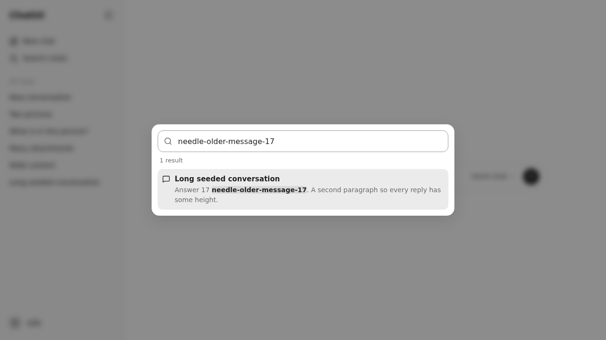
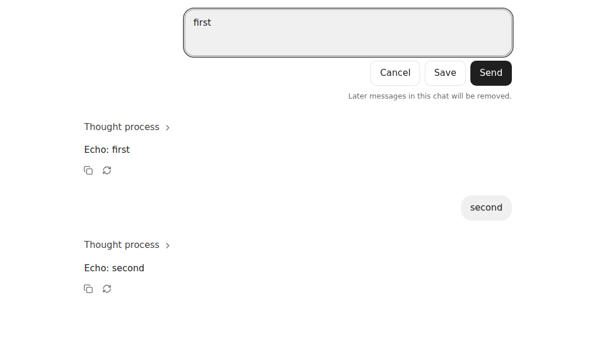

## Phase 13a report

- **Scope completed (files/features):**
  - Turn grammar and operations (`server/chat/turns.ts`): exchanges, mid-conversation system blocks, irregular regions; edit/regenerate truncation; delete exchange; the `isSourceValid` hook for Phase 13b.
  - Mutations (`server/chat/mutations.ts`, routes in `server/routes/conversations.ts`):
    - `PATCH /api/conversations/:id/messages/:messageId` (edit)
    - `DELETE /api/conversations/:id/messages/:messageId?expectedRevision=` (delete exchange)
    - `DELETE /api/conversations` (clear history)
    - `PUT`/`DELETE /api/conversations/:id/pin`
    - Each runs under the conversation lock, with `GENERATION_IN_PROGRESS`, `CONFLICT` on a stale revision and `VALIDATION` on irregular regions. Attachments of removed turns go after the Markdown.
  - Regeneration (`SendService.regenerate`, `POST /api/conversations/:id/regenerate`):
    - A §4.1 acceptance with its own operation key.
    - A fresh provider contact (`ModelCatalog.contact`) and preflight before any truncation.
    - No duplicate user block; fresh generation and assistant ids.
    - Crash recovery by before/after hashes.
  - No resurrection: terminal writes and restart recovery only answer a surviving source turn (the last block).
  - Search (`server/chat/search.ts`, `GET /api/search`): per user, bounded, malformed-tolerant, snippets, message ids.
  - Pins in canonical preferences (`PreferencesStore.modify`); stale pins removed on deletion; `pinnedRank` on the conversation list.
  - UI:
    - Lazy `SearchDialog` (Ctrl/⌘+K, combobox/listbox keyboard model), with message navigation (`#m-<id>` scroll-into-view and highlight).
    - Pinned sidebar section; Pin/Unpin in the row and title menus.
    - Per-message Edit/Delete/Regenerate/"Get a reply" with confirmations; lazy inline `MessageEditor` (Cancel/Save/Send).
    - Settings → Delete all chats.
- **Acceptance criteria with test evidence:**
  - `tests/server/mutations.test.ts` (18 tests):
    - Grammar: exchanges, irregular leading assistant and second response.
    - Truncation vs delete-exchange; source validity.
    - Edit keeps id/time, truncates downstream including a mid-conversation system block, returns the new revision; stale revision → `CONFLICT` unchanged.
    - Delete exchange keeps later turns; irregular layouts rejected unchanged.
    - Running generation → `GENERATION_IN_PROGRESS`; cancel → terminal → mutation.
    - Attachment lifecycle (removed-turn attachments deleted, kept ones linked, pending one linked by edit).
    - Regenerate: fresh ids, no duplicate user, downstream removed; unanswered turn; same key → same result without a second truncation; key mismatch.
    - Provider unreachable → untruncated; INV-44 capability rejection unchanged.
    - Edit→regenerate with an intervening change → `CONFLICT`, edited turn kept.
    - Regeneration crash recovery by hashes (one interrupted reply).
    - A late recovery reply for a superseded turn is discarded.
    - Search: user-scoped, Unicode case-insensitive, message ids, malformed skipped and counted, limits, literal metacharacters.
    - Pins: order, other preferences kept, survive a rebuild, dropped on delete.
    - Clear history: attachments gone, other preferences and other users untouched.
  - `tests/client/conversation-ops.test.tsx` (5):
    - Actions offered and disabled while a reply runs.
    - Delete confirmation and expected revision, updating the cached conversation.
    - Editor: Escape cancels; Save is edit-only.
    - Pinned section order and cache update.
    - Search: debounced single request, arrow keys, `aria-activedescendant`, Enter navigates to `#m-…`.
  - `tests/e2e/conversation-ops.spec.ts` (7, production build):
    - Search opens an older message scrolled into view and marked.
    - Ctrl+K/Escape with focus return.
    - Pin survives a reload; unpin from the title menu.
    - Edit+Send replaces the reply and removes later turns.
    - Delete exchange keeps later turns; regenerate confirms and replaces.
    - Clear history.
    - Phone: action buttons visible at 44 px.
  - Regression fixtures: two Phase 6 recovery tests fabricated operation records whose `userMessageId` wasn't in the file (a state no crash produces). They now name the file's actual last user block; all their assertions are unchanged. The primitives test now expects the row menu's third item (Rename, Pin, Delete).
- **Screenshots:**  
- **Quality gates:**
  - `format:check`, `lint`, `typecheck`: PASS
  - `test`: PASS (39 files, 538 tests)
  - `verify`: PASS (84/84)
  - `test:e2e`: PASS (58/58)
  - `perf:check`: PASS, with no budget change. Critical chat JS is 196.6 KB against the 193.9 KB budget (+1.4%, within tolerance).
  - `npm audit`: 0 vulnerabilities
  - `verify:compose`: no Docker daemon or Podman here; it runs in CI on the pushed commit.
- **Invariants:**
  - INV-35 → turn grammar, mutation locks and revisions, regeneration acceptance, source-turn guard → the tests above. The proposal portion comes with 13b, using `isSourceValid`.
  - INV-36 → `searchConversations` → the server, client and E2E search tests.
  - INV-34 regressions → pin tests (rebuild, order, other fields, stale pin).
- **Security, data, performance:**
  - Every mutation is CSRF + expected-user protected, with strict schemas and cross-user 404s (per-user store paths).
  - Search reads only the caller's files and treats the query as a literal.
  - Nothing is truncated before the replacement prompt is validated and the provider answers.
  - Search reads the canonical files per query (no index to drift); fine for personal-scale histories, and a derived cache can be added later if needed.
- **Dependencies:** none new.
- **Deviations / limitations:**
  - `FEATURE-MATRIX.md` isn't part of this repository (the phase package is kept out of it), so the feature evidence lives in `ARCHITECTURE.md` "Conversation operations" and this report.
  - Regenerate uses the composer's current model (else the last reply's).
  - Search has no stemming or ranking beyond newest-first.
  - Live provider behaviour is covered by the mock only.
- **Commit/tag status:** commit `feat(phase-13a): search pins and conversation mutations`, pushed to `claude/youthful-maxwell-yjyj9c` and `main`. The session's git proxy refuses tag pushes (as for `phase-12`), so the `phase-13a` tag is local only.
- **Questions needing approval:** none.
