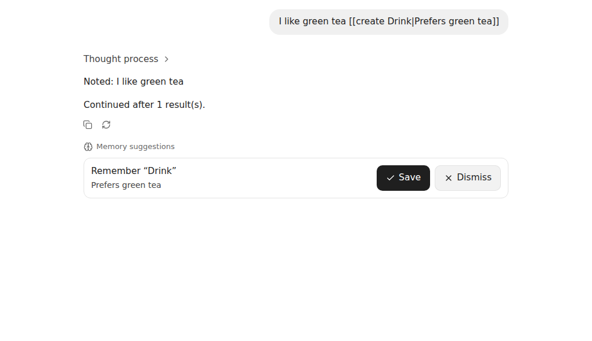
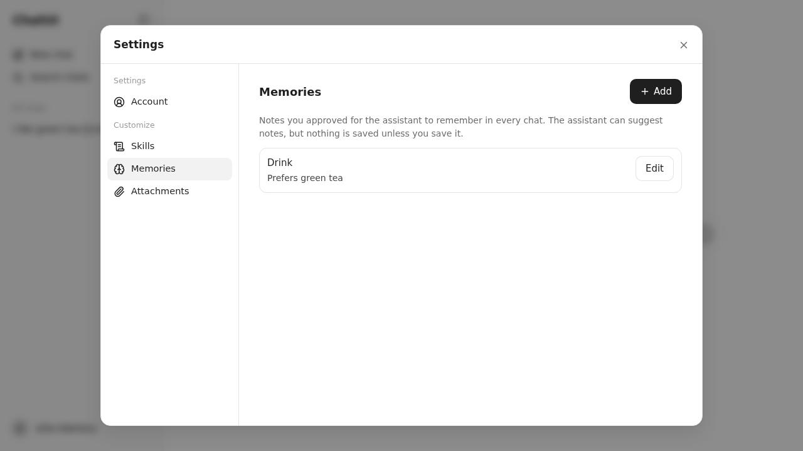

## Phase 13b report

- **Scope completed (files/features):**
  - Memory store (`server/storage/memories.ts`, `shared/memories.ts`): `memories/<uuid>.md` with the §12 front matter; the SHA-256 revision; NFC + case-folded unique names under the memory lock; per-note, count and total caps.
    - CRUD routes (`server/routes/memories.ts`): `GET/POST /api/memories`, `PATCH/DELETE /api/memories/:id` with `expectedRevision`.
  - Prompt: approved notes follow the per-model system prompt, without template expansion, within `MEMORY_PROMPT_BUDGET` (whole notes, name-then-id order, omitted notes reported). The memory snapshot is recorded in the checkpoint, and the memory-set revision is rechecked at acceptance step 3.
  - Provider adapter (`server/providers/llamacpp.ts`, `types.ts`): the `tools` request field, streamed `delta.tool_calls` fragments, and continuation messages (an assistant `tool_calls` message plus `role: "tool"` results).
  - Proposal tools (`server/chat/memory-tools.ts`):
    - Three allowlisted tools, offered only to models whose server-verified capabilities include `tools`.
    - Bounded streaming (argument bytes, call cap, 32 tracked calls) and strict validation. Update/forget must resolve in the snapshot.
    - Duplicate suppression; the fixed synthetic results from §4.3.
  - Single continuation (`server/generations/manager.ts`):
    - Same prompt plus the call/result messages, no tools, the remaining output tokens and time.
    - The same generation, SSE stream and assistant id. Text and reasoning are joined with one blank line.
    - Skipped on exhaustion, when it wouldn't fit the context, or on a provider rejection. The last request decides the status.
  - Records (`server/storage/proposals.ts`, `server/chat/proposals.ts`):
    - Canonical sidecars keyed by `(generationId, callIndex)`. Staged records ride in the `terminal-decided` checkpoint and are written after the assistant under the conversation lock (only for a `complete` reply with a surviving source).
    - SSE `proposals` previews and actionable `proposalIds` on the terminal event.
  - Acceptance and rejection (`POST /api/conversations/:id/proposals/:pid/accept|reject`):
    - Conversation → sidecar → memory locks; the source is rechecked; conditional create/update/forget against the snapshot baseline, with conflicts shown, never overwritten.
    - Intent (before/after hashes) → note → finalize. Idempotent.
  - Recovery: step 5 stages the proposals of completed checkpoints (also after "assistant written, proposals not"); step 6 settles intents by hashes.
  - Lifecycle: edit, delete exchange and regenerate invalidate pending proposals. Conversation deletion and clear history settle intents, then delete the Markdown, then the sidecar (a new `beforeDelete` hook).
  - UI:
    - Lazy `MemorySuggestions` cards under replies: Save/Dismiss, conflict messages, live-region announcements, and "The answer wasn’t generated" with Regenerate.
    - Streaming previews.
    - Lazy Settings → Customize → Memories: list, add, edit, delete, and "not included" markers.
    - `memories(user)` query key; proposals ride on the conversation DTO. Both are dropped on account change.
  - Probe (`scripts/probe-provider.ts`): a `tools` section records `streamsToolCalls`, `endsTurnAfterCall` and `continuation.acceptsToolResults`. `docs/provider-notes.md` documents them as UNVERIFIED, plus the degradation paths.
- **Acceptance criteria with test evidence:**
  - `tests/server/memories.test.ts` (35 tests):
    - File format round-trip; the filename is authoritative.
    - Name rules and case/NFC collisions, including `Straße`/`STRASSE` and composed/decomposed `é`; non-UUID files ignored (case-insensitive copy).
    - Caps; deterministic budget selection.
    - CRUD with revisions, CSRF, cross-account 404.
    - Budget-omitted notes reported. Memories in the prompt without template expansion; no tools for non-tool models; the snapshot in the checkpoint; tool schemas counted (`CONTEXT_TOO_LARGE` only with tools).
    - Text-before-call, call-only and multi-call: one assistant block, no tool content in Markdown, a tool-free continuation that equals the first prompt plus the two messages, reasoning joined.
    - No tool content in any later prompt.
    - SSE previews before the terminal event; `proposalIds`.
    - Invalid, unknown, oversized and over-cap calls dropped with a complete answer; 32 calls tracked at most.
    - Duplicates suppressed against pending, rejected and current memory.
    - Continuation skipped on exhausted tokens and when it doesn't fit; provider rejection keeps the text so far; the empty answer stays `complete`.
    - Continuation failure → `failed`, timeout → `timed_out`, proposals discarded in both.
    - Update/forget of an omitted or unknown note is invalid.
    - Accept, double accept, reject, accept-after-reject 409; a stale note conflicts; INV-38 edit between generation acceptance and the tool call; concurrent accept vs manual update (exactly one wins); forget.
    - Invalidation by delete exchange, regenerate and edit; validity rechecked when sidecar cleanup was missed.
    - Deletion and clear history remove sidecars and keep memories.
    - Recovery:
      - A crash after the intent → retryable.
      - A crash after the note write → accepted, never rolled back.
      - A hand-edited note → a reported conflict.
      - Deletion with an open intent.
      - A crash after the assistant write → proposals exactly once, also from a restored copy of the data directory and on a second restart.
      - A crash before the Markdown write → reply then proposals.
      - Interrupted source and deleted conversation → discarded.
  - `tests/client/memories.test.tsx` (8): the Save flow updates the cache and announces; a conflict message; the empty answer with Regenerate; resolved states have no actions; streaming previews aren't actionable; Settings list, omitted marker and edit with revision; name validation and server conflict; account switch purges memory keys.
  - `tests/e2e/memories.spec.ts` (5, production build): suggestion → nothing saved → Save → listed in Settings; Dismiss from the keyboard; the empty answer; Settings create/edit/delete; phone 44 px targets.
  - `verify` (+3): the memory file named by UUID with the §12 front matter; memories in the prompt with no tools for a non-tool provider; unknown-proposal accept is a JSON 404.
  - Regression changes:
    - The E2E setup now writes `providers.json` with the bootstrap-equivalent `local` provider plus a tool-capable `tools` provider on the same mock.
    - The admin model-visibility label now names the provider (two rows had the same accessible name). The two admin E2E tests use the new label and check hiding per provider.
    - The config test includes the new defaults.
- **Screenshots:**  
- **Quality gates:**
  - `format:check`, `lint`, `typecheck`: PASS
  - `test`: PASS (41 files, 581 tests)
  - `verify`: PASS (87/87)
  - `test:e2e`: PASS (63/63)
  - `perf:check`: PASS, with no budget change. Critical chat JS is 197.0 KB (+0.5 KB). The lazy chunks now include `MemorySuggestions` and `MemorySettings`.
  - `npm audit`: 0 vulnerabilities
  - `npm outdated`: only the documented pins (`@types/node` for the Node 24 runtime, TypeScript 6.0.3 for typescript-eslint)
  - `verify:compose`: no Docker daemon or Podman here; it runs in CI on the pushed commit.
- **Invariants:**
  - INV-37 → model calls only validate and stage; memory writes only through the user's CRUD and acceptance routes → the server/client/E2E/verify tests above.
  - INV-38 → the snapshot baseline plus conditional acceptance with intents → stale-note, between-acceptance-and-call and concurrency tests.
  - INV-39 (memory/proposal portion) → per-user paths and user-scoped keys → the cross-account 404s and the account-switch test. The artifact portion is pending (13c).
  - INV-60 (13b portion) → step 5 staging and step 6 intents → the recovery tests, including backup restore.
- **Security, data, performance:**
  - The model can't write approved memory. Suggestions are data rendered as text, and the tool results are fixed strings.
  - No model-supplied string becomes a path; invalid calls are logged without content; no raw upstream payload is retained.
  - Memories are never template-expanded and are introduced as information, not instructions.
  - Portability and backup: all canonical memory data is `memories/*.md` and `proposals/*.json` in the user directory, and intents live in the proposal records, so Phase 13d export and Phase 16 backup cover them by including the user directory and `_system/generations`. Not implemented here.
- **Dependencies:** none new.
- **Deviations / limitations:**
  - Live tool-calling behaviour is UNVERIFIED: no llama-server was reachable. Run the probe before enabling `tools: true` for a provider.
  - Tool schemas are counted as their tokenized JSON, because `/apply-template` is called without `tools`. A verbose template makes the synchronous `CONTEXT_TOO_LARGE` check best-effort.
  - The conversation DTO carries `proposals`; `GET /api/conversations/:id/proposals` also exists.
  - `MEMORY_PROMPT_BUDGET` is in bytes and is also capped at a quarter of a model's prompt budget, so a small-context model may include fewer notes than Settings shows as included.
  - `FEATURE-MATRIX.md` isn't part of this repository (the phase package is kept out of it); the feature evidence is in `ARCHITECTURE.md` "Approved memories and proposals" and this report.
- **Commit/tag status:** commit `feat(phase-13b): approved memories and proposal-only tools`, pushed to `claude/youthful-maxwell-yjyj9c` and `main`. The session's git proxy refuses tag pushes (HTTP 403), so the `phase-13b` tag is local only, like `phase-12` and `phase-13a`. Push it with `git tag phase-13b <commit> && git push origin phase-13b`.
- **Questions needing approval:** none.
