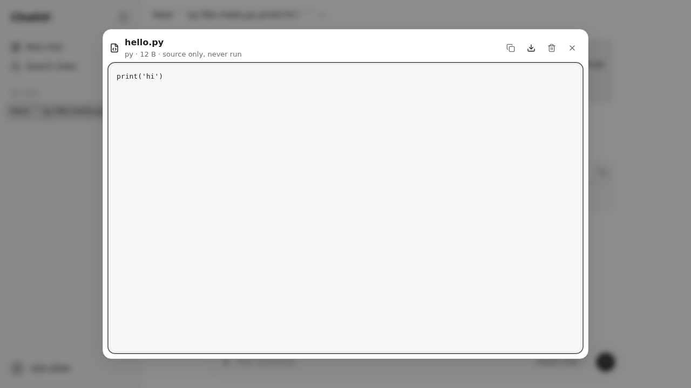
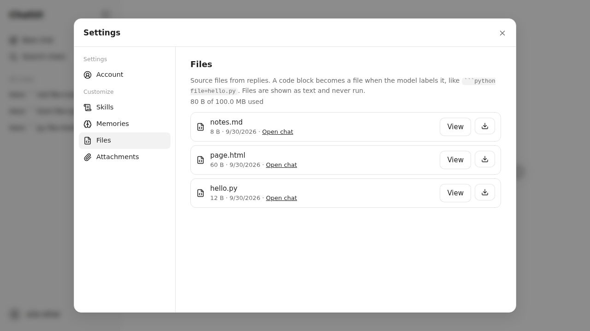

## Phase 13c report

- **Scope completed (files/features):**
  - Capture convention (`server/artifacts/capture.ts`, pure and deterministic):
    - A closed, top-level fenced block whose info string has `file=<name>` (or `file="<name>"`).
    - Plain file names with an allowlisted extension or exact name; path-like, hidden, unknown-type and control-character names are rejected, never normalized.
    - Non-empty bodies up to `ARTIFACT_MAX_BYTES`, at most `ARTIFACT_MAX_PER_REPLY` per reply, `captureIndex` in document order.
    - No prompt instructions are added: an admin can ask for labelled files in a model's system prompt.
  - Storage (`server/storage/artifacts.ts`):
    - `artifacts/<uuid>/{blob,meta.json}`, bytes first and metadata last. The stable key `(assistantMessageId, captureIndex)`, a `finalized` flag, and the per-user quota (`ARTIFACT_QUOTA_BYTES`).
    - Only finalized artifacts are listable, viewable or deletable.
  - Terminal sequence:
    - The manager stages captures from a `completed` reply's final text in the `terminal-decided` checkpoint (`outcome.captures`).
    - `persistOutcome` writes, under the conversation lock: assistant → proposals → captures (idempotent: an existing key is kept) → finalize. The `terminal` checkpoint follows.
  - Recovery:
    - Step 5 completes staged captures after the reply (or when the reply already exists).
    - Step 7 removes metadata-less directories and unfinalized artifacts without an open checkpoint.
    - No historical scan.
    - Deleting an artifact first marks its generation's checkpoint `terminal`, so nothing can recreate it.
  - Routes (`server/routes/artifacts.ts`): list (with used/quota bytes), metadata, inert source (`text/plain; charset=utf-8`, `nosniff`, `sandbox; default-src 'none'`, safe Content-Disposition, `?download=1`) and delete. No upload route. Cross-user ids are 404.
  - The conversation DTO carries its `artifacts` cards. Artifacts survive conversation deletion and clear history (`backlinkAvailable: false`), and go with the account.
  - UI:
    - File cards under replies.
    - Lazy `ArtifactPanel`, a Radix Dialog: focus starts on the source; Escape returns focus to the card; source shown as a text node; Copy, Download, and Delete with confirmation; full-screen on phones.
    - Lazy Settings → Customize → Files.
    - Query keys `artifacts(user)` and `artifactSource(user, id)`, dropped on account change.
  - Import representation for Phase 13d is defined in `ARCHITECTURE.md` (`source: "imported"`, keyed by the import journal), not built.
- **Acceptance criteria with test evidence:**
  - `tests/server/artifacts.test.ts` (18 tests):
    - Capture fixtures: fences, tildes, indentation, block quotes, quoted names, unclosed fences, CRLF determinism, name/type rejection, size/count limits, empty bodies.
    - Complete-only: failed and cancelled replies (with the fence in their text) create nothing.
    - Rejected names/types/sizes; quota; no historical scan; transcript cards; id-named directories.
    - XSS payloads (`<script>`, `onerror`, SVG `onload`) served as `nosniff` text/plain with the sandbox CSP; a quote in a name is sanitized in `Content-Disposition`.
    - Cross-account 404s (list, metadata, source, delete); survival across conversation deletion and clear history with dead backlinks; independent delete.
    - INV-40/INV-60:
      - A crash after creation and before finalization: invisible, not deletable; restart finalizes the same artifact once; delete; evict the checkpoint; restart; it stays deleted.
      - Deleting while the checkpoint is still `terminal-decided` finalizes it; a restart recreates nothing.
      - A crash before creation: created exactly once across two restarts.
      - A deleted originating conversation: never captured.
      - A metadata-less directory and an orphan unfinalized artifact are removed; an interrupted reply captures nothing.
  - `tests/client/artifacts.test.tsx` (4):
    - The card opens the lazy panel; HTML shows as text with no `script`/`img` element and nothing run; focus starts on the source, and Escape returns it to the card; the download link.
    - Delete with confirmation removes the card.
    - Files list with live and dead backlinks.
    - Account switch drops list and source caches.
  - `tests/e2e/artifacts.spec.ts` (4, production build):
    - Keyboard open, panel, Escape and focus return; the cold open time is recorded.
    - No dialog or script runs, in the panel or when the source URL itself is opened in the browser.
    - Settings → Files, then deleting the chat shows "Chat deleted".
    - Phone: a full-screen panel, 44 px controls, no horizontal page scroll.
  - `verify` (+4): the capture once, in a directory named by id; inert headers and body; no upload endpoint; plus the demo-send check.
  - Regression fixes:
    - `verify` now exits on a failed step instead of hanging on the open mock server.
    - The Phase 13b memory check waits for its generation (the provider's single slot).
    - The memory and file E2E specs use the second existing account instead of new ones: every sign-in counts toward the 10-per-15-minutes login limit, and two extra accounts pushed the run over it.
    - The mock's `mock-slow` and `mock-early-end` echo a fenced message so cancelled and failed replies can be tested.
- **Screenshots:**  
- **Quality gates:**
  - `format:check`, `lint`, `typecheck`: PASS
  - `test`: PASS (43 files, 603 tests)
  - `verify`: PASS (91/91)
  - `test:e2e`: PASS (67/67)
  - `perf:check`: PASS. Critical chat JS is 198.1 KB (+1.1 KB); critical CSS is 5.5 KB. The new on-demand budget `artifact-panel-on-demand` is 1,872 B (panel chunk plus `artifacts.css`). `ArtifactPanel` and `ArtifactSettings` are lazy-only.
  - `npm audit`: 0 vulnerabilities
  - `npm outdated`: vitest updated to 5.0.3; only the documented pins remain (`@types/node` for the Node 24 runtime, TypeScript 6.0.3 for typescript-eslint)
  - `verify:compose`: no Docker daemon or Podman here; it runs in CI on the pushed commit.
- **Invariants:**
  - INV-40 → the capture rule, staged captures, idempotent capture, finalized-only visibility, delete-finalizes-checkpoint, no scan → the recovery and complete-only tests.
  - INV-41 → text/plain + `nosniff` + sandbox CSP + safe disposition, id-named directories, validated names, text-node rendering, no upload route → the XSS and header tests (server, client, browser).
  - INV-39 (artifact portion) → per-user paths and keys → the cross-account and account-switch tests. INV-39 is now complete.
  - INV-60 (13c portion) → step 5 captures and step 7 cleanup.
- **Security, data, performance:**
  - Source never executes on the app origin: the server never serves it as HTML, and the client never parses it.
  - Downloads use `Content-Disposition: attachment` with a sanitized ASCII fallback.
  - Names are display-only.
  - Artifacts are canonical user data inside the user directory, so Phase 13d export and Phase 16 backup cover them.
  - The in-memory catalog is derived and rebuilt from the files.
  - Optional execution stays Phase 19 and is not enabled.
- **Dependencies:** vitest 5.0.2 → 5.0.3. Nothing new.
- **Deviations / limitations:**
  - Capture is opt-in through the `file=` label (documented); ChatUI doesn't add prompt instructions.
  - A backlink to a reply that was edited or regenerated away opens the chat without the anchor.
  - `FEATURE-MATRIX.md` isn't part of this repository; the evidence is in `ARCHITECTURE.md` "Generated source artifacts" and this report.
- **Commit/tag status:** commit `feat(phase-13c): inert generated source artifacts`, pushed to `claude/youthful-maxwell-yjyj9c` and `main`. The session's git proxy refuses tag pushes (HTTP 403), so the `phase-13c` tag is local only. Push it with `git tag phase-13c <commit> && git push origin phase-13c`.
- **Questions needing approval:** none.
