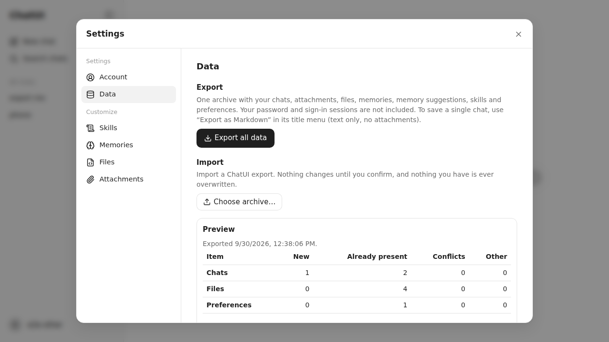

## Phase 13d report

- **Scope completed (files/features):**
  - Single-chat export: `GET /api/conversations/:id/export` returns the exact canonical bytes (malformed files too, never reserialized) as a `text/markdown` attachment, from the title menu's "Export as Markdown".
  - Archive format (`server/portability/archive.ts`): `chatui-user-archive` v1, a fixed ZIP layout whose manifest gives every entry's length and SHA-256 and marks mid-reply conversations. User content only.
  - Export (`server/portability/export.ts`, `POST /api/exports`, `GET /api/exports/:id/download`):
    - A barrier-exclusive snapshot of the small files; blobs are opened after the barrier is released, hashed while zipped, and a deleted or changed one gives a retryable 409.
    - Staging under `import-staging/exports/`, kept for an hour, swept at startup and hourly.
  - Import (`server/portability/read-archive.ts`, `server/portability/import.ts`, routes in `server/routes/portability.ts`):
    - Streaming upload into `import-staging/<id>/`.
    - Bounded preflight: entries, names, symlinks, encryption, duplicates, depth, expanded total, ratio, per-kind caps, streamed checksums, time.
    - A preview with no writes.
    - A plan with identical-skip, conflict skip/copy, consistent remapping (conversations, attachments with Markdown rewrite, artifacts and backlinks, proposals and target/result memories, pins), the dependency rules, the malformed-raw rule, explicit memory selection, pending proposals made invalid, skills, and preferences merged without replacement.
    - A create-only commit with a write-ahead hash journal, compensation on failure, rollback at startup (step 3), a duplicate-key ledger with explicit "Import again", cancel, and 24-hour staging retention.
  - UI: lazy Settings → Data (export with a download link; import with upload progress and cancel, a preview table, conflict and skip lists, choices, confirmation, polled progress and a report); "Export as Markdown" in the title menu.
  - Config: `IMPORT_MAX_ARCHIVE_BYTES`, `IMPORT_MAX_EXPANDED_BYTES`, `IMPORT_MAX_ENTRIES`, `IMPORT_MAX_RATIO`, `IMPORT_MAX_MS`.
- **Acceptance criteria with test evidence:**
  - `tests/server/portability.test.ts` (18 tests):
    - Exact raw export, valid and malformed, with cross-account 404.
    - The manifest: lengths and checksums; only user content (no account, sessions, recovery state, indexes or drafts).
    - The exclusive barrier is held only for small files: a write during the snapshot waits, a write while blobs are copied does not.
    - A blob deleted mid-export → retryable 409, then a clean retry.
    - An active generation is exported in its accepted state and marked.
    - The full round trip into another account (conversation bytes, attachment and artifact blobs and metadata, memories, skills, pins; accepted proposals kept, pending ones invalid).
    - Restore of a deleted chat with identical-skip; a repeat refused as a duplicate unless confirmed.
    - Conflicts: default skip, then copies with remapped ids, rewritten Markdown, linked attachment metadata, the copy's sidecar and pin, and the attachment served through the API.
    - Dependency rules: the attachments, proposals and pin of a skipped conversation are dropped; its artifact keeps a dead backlink; proposals targeting an unimported memory become invalid.
    - Case-insensitive memory name collision: never replaced.
    - A malformed conversation imports raw, and is skipped when a remap is needed.
    - Hostile archives: traversal, absolute and backslash names, symlink, duplicate entry, ZIP bomb, entry-count, expanded-size and archive-size limits (413), a bad checksum, an unlisted entry, a missing manifest, a foreign format, an unknown entry reported, the time limit.
    - Cancel removes the staging; another user can't see the import.
    - A crash mid-commit, then restart: rolled back, pre-existing data untouched.
  - `tests/client/data.test.tsx` (4): export with the download link; preview defaults (skip, no memories), choices sent, progress polled, report, affected queries invalidated; the duplicate needs "Import again"; cancel; a refused archive's reason is shown.
  - `tests/e2e/data.spec.ts` (3, production build):
    - Title-menu Markdown export, with the exact file shape.
    - Export everything, delete a chat, import the archive, and the chat is back; the export time and upload-to-preview time are recorded (preview under 5 s).
    - Phone: the preview fits the width, and Cancel and Import are 44 px targets.
  - `verify` (+2): the export downloads a ZIP with a manifest; re-importing your own archive previews everything as already present.
- **Screenshots:** 
- **Quality gates:**
  - `format:check`, `lint`, `typecheck`: PASS
  - `test`: PASS (45 files, 625 tests)
  - `verify`: PASS (93/93)
  - `test:e2e`: PASS (70/70)
  - `perf:check`: PASS. Critical chat JS is 198.2 KB. The new on-demand budget `data-settings-on-demand` is 3,915 B, and `DataSettings` is lazy-only.
  - `npm audit`: 0 vulnerabilities
  - `npm outdated`: only the documented pins remain
  - `verify:compose`: no Docker daemon or Podman here; it runs in CI on the pushed commit.
- **Invariants:**
  - INV-42 → the bounded reader, preview-before-write, create-only commit, hash-matched rollback, the session user as the only destination → the hostile-archive and recovery tests. The Claude format is pending 13e.
  - INV-43 → raw export, manifest checksums, snapshot and verified blobs, the round trip → the export and round-trip tests.
  - The `import-staging/` layout, retention and recovery are documented in `ARCHITECTURE.md` "Export and import".
- **Security, data, performance:**
  - Archive names never become paths (positional staging names; destination paths come from validated ids).
  - Sizes are enforced on the bytes, not trusted from headers.
  - Imports never overwrite and never make a suggestion actionable.
  - Staging is transient, removed with the account, and never exported.
- **Dependencies:** `yauzl` 3.4.0 and `yazl` 3.3.1 (plus `@types/yauzl` 3.4.0 and `@types/yazl` 3.3.1): the widely used streaming ZIP reader and writer, the reader with entry-size validation.
- **Deviations / limitations:**
  - Snapshot consistency is per file (documented, with the importer tolerating the lag), because making multi-file operations barrier-atomic would need every writer to take the barrier before its locks.
  - Skills are included as user-owned data.
  - A repeat import needs an explicit confirmation.
  - Preference settings other than pins apply only where unset.
  - `FEATURE-MATRIX.md` isn't part of this repository; the evidence is in `ARCHITECTURE.md` and this report.
- **Commit/tag status:**
  - Commit `feat(phase-13d): portable user export and import`, pushed to `claude/youthful-maxwell-yjyj9c`. At the owner's request, `main` is updated once all of Phase 13 is complete.
  - The session's git proxy refuses tag pushes, so the `phase-13d` tag is local only.
- **Questions needing approval:** none.
