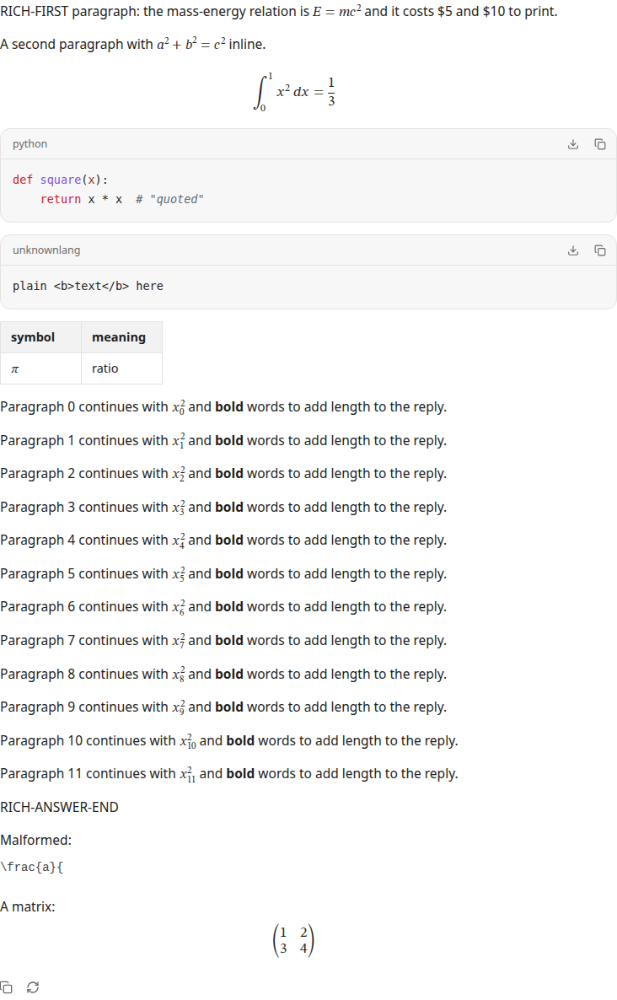
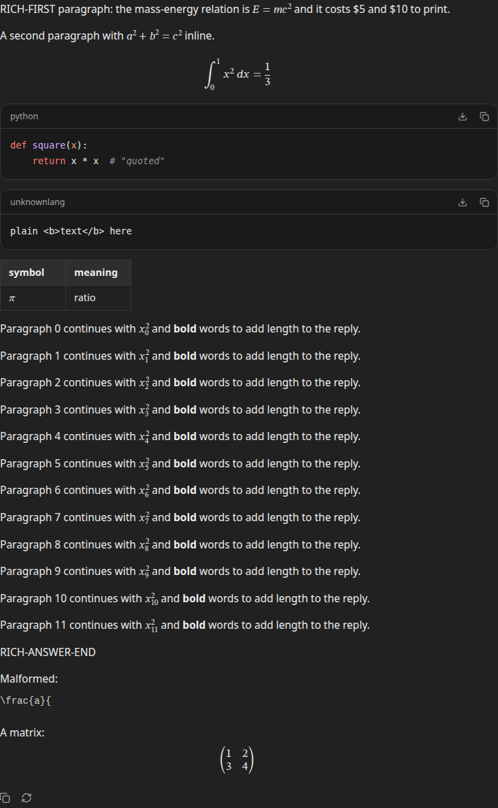
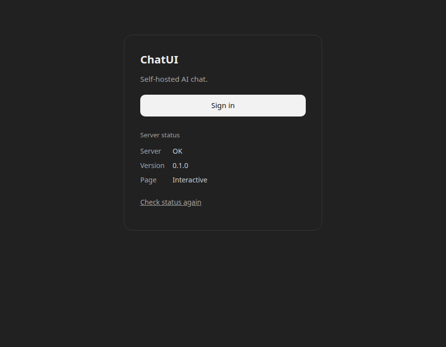

## Phase 14 report

- **Scope completed:**
  - **Math (new feature).** LaTeX renders as MathML with Temml:
    - Delimiters: `$…$` and `\(…\)` inline; `$$…$$`, `\[…\]` and `$$` fences for display.
    - Our own inline tokenizer (`app/lib/remark-math-parse.ts`) uses Pandoc's rules, so `$5 and $10` stays text.
    - The lazy renderer (`app/components/math/MathView.tsx`) builds React elements from an allowlist, runs with `trust: false`, and caps macro expansion and formula size.
    - Invalid formulas show their inert source with the reason.
    - Copy: "Copy LaTeX" on display formulas, LaTeX on the clipboard when a selection includes math, and a TeX annotation in the MathML.
    - Server HTML contains the rendered math (the module is preloaded on the server, and the browser hydrates lazily).
    - The first-party STIX Two Math font downloads only on systems without a math font.
  - **Code blocks.**
    - Language label, "Copy code" and "Download code" (exact source, `snippet.<ext>`).
    - Keyboard-scrollable `<pre>`.
    - Lazy highlighting: lowlight, with 48 grammars at one chunk each. It is never HTML, stays plain for unknown languages, oversized blocks and an unfinished fence while streaming, and uses AA-contrast colors in both themes.
  - **Streaming.** The live reply renders block by block (`app/lib/markdown-blocks.ts`). Finished blocks keep their DOM, selection and focus, and each token re-parses only the last two blocks. Stored replies still render as one document.
  - **Feature origins (INV-52).** A `shared/features.ts` register and Settings → Features: built into ChatUI, depends on the model (naming the models that provide it), or not available.
  - **Home page (owner request).** "Sign in" / "Open your chats" is the primary button. Server status is a subdued section below with a text-style "Check status again". `/` stays the public status page the Phase 1a spec requires.
  - `CopyButton` moved to its own module; `perf-check` has new budgets and a grammar-leak check.
- **Acceptance criteria with test evidence:**
  - `tests/client/rendering.test.tsx` (30 tests):
    - MathML and annotations; currency and escapes stay text.
    - Nine math injection vectors (`\href`, `\url`, `\includegraphics`, `\htmlStyle`/`Data`/`Class`, `<script>` in `\text`, a macro bomb, CSS in `\color`) render with no link, image or script element and no `on*`, `href`, `src` or `style` attributes.
    - Malformed and oversized math; no `\gdef` leak between formulas.
    - Copy LaTeX; selection copy as `$…$`.
    - No `style=` in server HTML.
    - Every prefix of a math-heavy answer renders; an unfinished display formula stays source.
    - Code: highlighting keeps the exact text; unknown-language fallback; the size limit; copy and download bytes and name; an open fence stays plain until it closes.
    - Streaming:
      - Every prefix of a block-construct corpus renders identically to the whole-document parse.
      - The first block's DOM node and a selection survive growth.
      - Parse work per token is flat.
      - A 200-message conversation never re-renders or remounts stored messages.
  - `tests/client/features.test.tsx` (4): register classification, model capability lists, and a source scan that no component offers web search, voice, image generation or code running.
  - `tests/e2e/rendering.spec.ts` (5, production build, Chromium):
    - Server HTML has MathML, the math stylesheet link, no `style=` on MathML, and the malformed formula as source.
    - All requests are first-party, with no console or CSP errors.
    - Matrix padding is applied through the CSSOM.
    - A plain chat requests no renderer chunk.
    - Code: highlight, plain fallback, clipboard copy, the download file, Copy LaTeX, and keyboard horizontal scroll.
    - Reduced motion: no animations.
    - Streaming into a 200-message chat keeps a selection, the unpinned scroll position, and all 200 stored message nodes, and re-pins with "Jump to latest".
  - `tests/e2e/ui.spec.ts` pinned-follow still passes (the E2E caught a regression from `useDeferredValue`, which was then removed).
- **Screenshots:**
  - 
  - 
  - 
- **Quality gates:**
  - `format:check`, `lint`, `typecheck`: PASS
  - `test`: PASS (48 files, 675 tests)
  - `build`: PASS
  - `verify`: PASS (93/93)
  - `test:e2e`: PASS (75/75)
  - `perf:check`: PASS
  - `npm audit`: 0 vulnerabilities
  - `npm outdated`: only the documented TypeScript/@types/node pins remain
  - `verify:compose`: no Docker or Podman here; CI runs it.
- **Invariants:**
  - INV-45 → the sanitize schema, `safeUrl`, the math tokenizer, Temml `trust: false` with the allowlisted tree conversion and CSSOM styles, and hast → React highlighting → the rendering and markdown unit tests, plus the E2E CSP and first-party checks.
  - INV-46 → `BlockSplitter` and keyed memoized parts, rendered in the same commit as the scroll pin → the rendering unit tests and the rendering/ui E2E.
  - INV-52 → `shared/features.ts` and Settings → Features → `features.test.tsx`.
  - INV-22 is extended with the new tests.
- **Security, SSR, data and performance:**
  - Stored Markdown is never changed.
  - The CSP is unchanged: no `unsafe-inline`, and math needs no style attributes.
  - The math chunk loads after the composer is interactive and never blocks it; the server preload only affects server rendering.
  - Critical chat JS grew from 193.9 to 202.8 KB gzip (+8.9 KB: math parser, block splitting, code actions); the budget was rebaselined.
  - On demand: math 62.9 KB, highlighter 10.3 KB, largest grammar 6.9 KB. `all-client-js` (447 KB) now includes the 48 grammar chunks.
  - Streaming the rich answer into a 200-message chat logged 5 long tasks, the longest 128 ms (Chromium, not asserted).
- **Dependencies** (pinned exactly):
  - `temml` 0.13.5: LaTeX → MathML, smaller than KaTeX and CSP-compatible.
  - `micromark-extension-math` 3.1.0 and `mdast-util-math` 3.0.0: `$$` fences and the mdast nodes.
  - `mdast-util-from-markdown` 2.0.3: the block splitter's parse; already a transitive dependency, now direct.
  - `lowlight` 3.3.0 and `highlight.js` 11.12.0: grammars as hast.
  - `hast-util-to-jsx-runtime` 2.3.6: hast → React; already used by react-markdown.
  - `@fontsource/stix-two-math` 5.3.0: OFL math font with its MATH table.
- **Deviations / limitations / unverified:**
  - MathML speech wasn't tested with a real screen reader (none in this environment). Chromium exposes `role=math`; screen-reader support varies.
  - `\cancelto` arrows lack their mask (a `data:` URL the CSP forbids).
  - Cross-block footnotes and reference links resolve only once the stored reply replaces the live one.
  - The live → stored swap still remounts that one reply (Phase 6 design), so a selection inside the finished live reply is lost at completion.
  - An editable code canvas was not adopted (not needed for read-only code).
- **Commit/tag:** `feat(phase-14): safe math code and streaming answer rendering` on `main`, tag `phase-14`, pushed to `origin` at the owner's request.
- **Also this session:** the owner's five exports (Claude conversations, memories, feedback, light metadata, duck.ai) were run through the real 13e import pipeline, from upload to commit. All import, and the stored chats parse; no code changes were needed.
